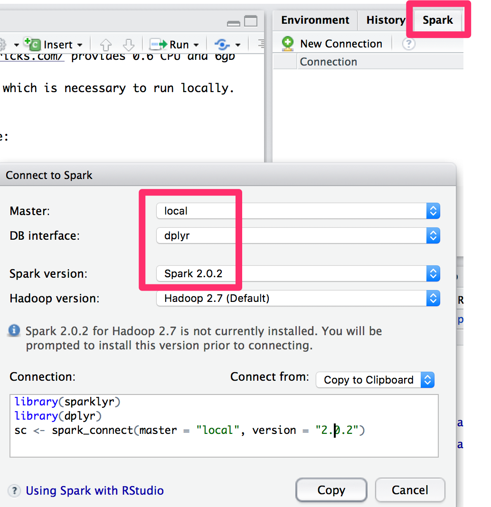

## Databricks 

Databricks is a commercial provider of a very convenient and hosted edition of spark.

- clogin to https://community.cloud.databricks.com
- create a folder
- import from URL https://databricks-prod-cloudfront.cloud.databricks.com/public/4027ec902e239c93eaaa8714f173bcfc/22670026808712/1314898482972300/1650315298576381/latest.html
- walk trhough the notebook
- examine Spark UI

## on your own laptop

## step 0 - prerequesites
install the following software:

- Rstudio https://www.rstudio.com/products/RStudio/
- R https://cran.r-project.org
- JDK8, on windows use https://adoptopenjdk.net/

## step 1 - installation

Install a some packages:

```{r, eval=FALSE, include=TRUE}
install.packages(c("sparklyr"))
```

then load it
```{r}
library(sparklyr)
```

## step 2 - start a (local) spark cluster
Either start /connect to the spark master from the GUI.

On the first run you also must download spark. First check for available versions. At the time of writing, the latest version is $2.4.0$ Feel free to choose this version or any more recent one.

```{r, eval=FALSE, include=TRUE}
spark_available_versions()
spark_install(version = "2.4.0")
```
 or execute the following code:

```{r, echo=TRUE}
suppressPackageStartupMessages(library("dplyr"))
#library(nycflights13)
#library(Lahman)
```

then connect:

```{r}
spark <- spark_connect(master = "local")

# in case you run on Databbricks uns the following method:
#spark <- spark_connect(method = "databricks")
```

open your browser and point it to: http://localhost:4040 browse the UI and familarize yourself.
Then, close the connection.

```{r}
spark_disconnect(spark)
```

Spark by default only starts with a small amount of memory:

```{r}
conf <- spark_config()
conf$`sparklyr.shell.driver-memory` <- "8G"
spark <- spark_connect(master = "local", config = conf)
```

Go again to http://localhost:4040 and look at http://localhost:4040/executors/. Did the amount of memory available to spark change?

Finally, close the spark session again.
```{r}
spark_disconnect(spark)
```
