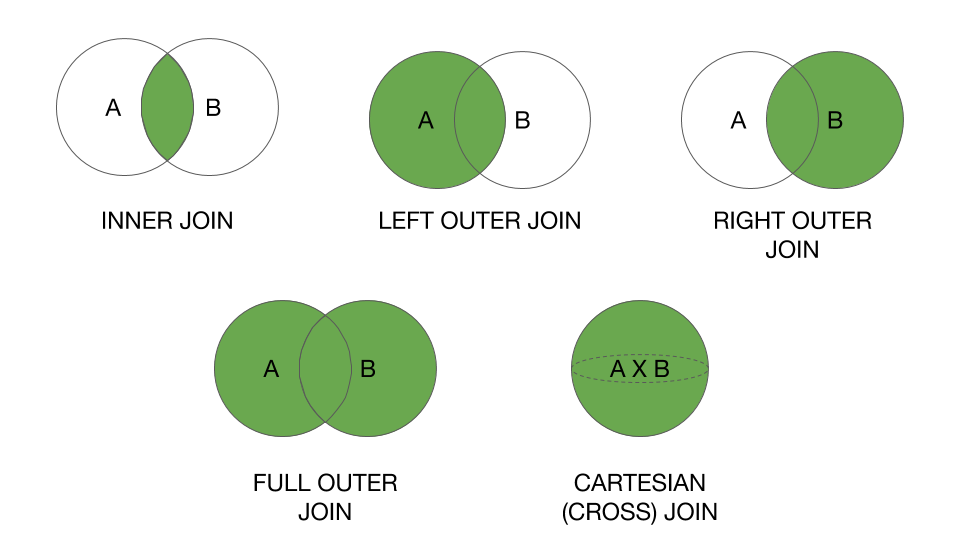

Load spark

```{r}
library(sparklyr)
library(dplyr)
library(arrow)
conf <- spark_config()
conf$`sparklyr.shell.driver-memory` <- "8G"
spark <- spark_connect(master = "local", config = conf)
```

One hour of Pagecounts from the Wikimedia projects captured March 1st, 2019, at 12:00 PM UTC. It can be obtained from https://dumps.wikimedia.org/other/pageviews/2019/2019-03/ and documentatin is found at: https://dumps.wikimedia.org/other/pageviews/readme.html

- Filetype: gzip compressed parquet
- size 80MB

## Create a DataFrame
Read the Parquet files into a DataFrame.

```{r}
pagecountsAllDF <- spark_read_parquet(spark, "datasets/wikimedia_edits.parquet")
```

Look to the right side of RStudio and use the Spark pane in the connections tab to examine the dataset.

## counting records
The `count()` action:
> Returns the number of rows in the Dataset.

`count()` will trigger a job to process the request and return a value.

To count all records in our `DataFrame` execute:

```{r}
sdf_nrow(pagecountsAllDF)
```

That tells us that there are around $6$ million rows.

Before taking a closer look let's introduce a technique that speeds up processing.

## `cache` and `persist``
Iterative algorithms, i.e. when a dataframe is used at least twice can greatly improve performance when caching intermediate results in memory or persisting to disk.

```{r}
tbl_cache(spark, "wikimedia_edits", force=FALSE)
# now go to: http://localhost:4040/storage/
sdf_nrow(pagecountsAllDF)
         # cache the dataframe
         # maaterialize
```

Run the `count` command again. It should be faster now. Again, look at the spark UI and see what is different in the execution graph.

```{r}
sdf_nrow(pagecountsAllDF)
```

To remove a table from the chace use: `sparklyr::tbl_uncache()`, but this is not necessary now.

## the data
`printSchema` shows the schema of the data, i.e. the data types for each column.

```{r}
sdf_schema(pagecountsAllDF)
```

Show unique values per project.

```{r}
pagecountsAllDF %>%
  select(project) %>%
    distinct()
```

When we also want to count how many unique values are present:

```{r}
pagecountsAllDF %>%
  group_by(project)%>%
  summarise(count_per_project = count())
```

When counting for unique number of articles per project, an approximative solution might be faster:

```{r}
# dplyr exact
pagecountsAllDF %>%
  group_by(project)%>%
  summarise(count_unique = n_distinct(article))

# dplyr approx
pagecountsAllDF %>%
  group_by(project)%>%
  summarise(count_unique = approx_count_distinct(article))
```

Watch the results closely and examine how good they lign up. Note, there is a tunable accuracy for the approximate method.

## Spark API Documentation

Find it at https://spark.apache.org/docs/latest/. Other Documentation:

- Programming Guides for DataFrames, SQL, Graphs, Machine Learning, Streaming...
- Deployment Guides for Spark Standalone, Mesos, Yarn...
- Configuration, Monitoring, Tuning, Security...

There is a different API and corresponding documentation for each language:

- [scala](https://spark.apache.org/docs/latest/api/scala/index.html#org.apache.spark.package)
- [java](https://spark.apache.org/docs/latest/api/java/index.html)
- [python](https://spark.apache.org/docs/latest/api/python/index.html)
- [R](https://spark.apache.org/docs/latest/api/R/index.html) for sparkR
- [sparklyR](https://spark.rstudio.com/reference/)
- [SQL](https://spark.apache.org/docs/latest/api/sql/index.html) also helpful in case a function is missing in the sparklyR API

## show

Spark usually differenciates between `show()`, `take(n)` and `collect()` which either show the first couple of rows to standard out, return the first n records as an array or collect the entire Dataframe into the memory of the Driver. Be careful with `collect` as it can easily kill the driver node with out of memory exception unless the data is filtered or aggregated first.


With sparklyR a simple:

```{r}
pagecountsAllDF

# be careful with what you collect locally
local_df <- sparklyr::collect(pagecountsAllDF)
```
is enough as the tibble is automatically reduced in the output a paginated table for the first couple of 1000 records.

## transformation vs. action

Here, we use the filter function (similar to SQL `WHERE`) to keep only rows matching our kriterion.

```{r}
transformedDf <- pagecountsAllDF %>%
  filter(requests == 1)
```

Notice how "nothing" happened -  no job was triggered.
We are simply defining the next step in our transformations.
It's not until we induce an action that a job is triggered and the data is processed.


```{r}
transformedDf
```

## slect

If you do not want to look at all the columns use `select()` 

```{r}
pagecountsAllDF %>%
    select(requests, bytes_served) 
```

It is one of the most powerful and commonly used transformations. `drop()` works similarly, but instead of keeping, removes the staed columns:

```{r}
pagecountsAllDF %>%
  select(-requests, -article)
```

## distinct and drop duplicates

Removes duplicates.
> WARNING ordering of records is important if you care about which duplicate is kept. Posibly a different column (time) might have an impact. To reliably deduplicate in such a case you should use a window function with rank.

```{r}
pagecountsAllDF %>%
  distinct(requests)
```

## SQL temporary view

If you want to execute plain SQL this is also really easy:

```{sql connection=spark, eval=FALSE, include=TRUE}
SELECT * FROM wikimedia_edits LIMIT 2
```
Also, if you want to store the result of the query into a dataframe to continue using it later on in the analytical process:

```{r}
sql_df <- sdf_sql(spark, "SELECT * FROM wikimedia_edits LIMIT 2")
dbplyr::sql_render(sql_df)
sql_df
```


## LAB 1
go to Lab 1 and try it yourself

## orderBy

Looking at the data it is apparent that there is no reason to assume the data is sorted on any of the columns.

To answer:
*What are the top 10 most requested articles?*
explicit ordering can be imposed:

```{r}
pagecountsAllDF %>% 
  arrange(requests)
```

This sorts the data, but in the wrong direction. We want to sort in descending order:

```{r}
pagecountsAllDF %>% 
  arrange(desc(requests))
```

And there are many more useful functions. Be sure to check out https://spark.rstudio.com/dplyr/

## window functions
Another useful kind of function are window functions

Let's work on another dataset. This time we copy an existing dataframe from R to spark.
```{r}
library(nycflights13)
flights <- copy_to(spark, flights, "flights")
airlines <- copy_to(spark, airlines, "airlines")
```

Now using a specific ordering per group it is easy to identify the first and last records (rank them) to figure out the most and least delayed flight per day

```{r}
bestworst <- flights %>%
  group_by(year, month, day) %>%
  select(dep_delay) %>% 
  filter(dep_delay == min(dep_delay) || dep_delay == max(dep_delay))
```

to debug we can have a look at the generate SQL statements:

```{r}
dbplyr::sql_render(bestworst)
```

Notice, no actual computation has been performed until now. The results are:

```{r}
bestworst
```

## JOINs

Spark supports various JOINs. Even non-equi-joins are possible.

```{r}
flights %>% left_join(airlines)
```

## writing data

Spark supports reading and writing data from and to various systems and file formats.

Writing to parquet, especially if gzip compressed still can be useful even for medium sized local files. The compression can be impressive.

```{r}
spark_write_parquet(flights, "datasets/flights" , mode="overwrite", options = list(compression="gzip"))
```

Notice the difference:
```{r}
spark_write_parquet(flights, "datasets/flights" ,partition_by = "carrier", mode="overwrite", options = list(compression="gzip"))
```

This command writes the data using partitioning.
In the Hadoop world, this commonly is referred to partition pruning. When querying for a specific value of the partitioning column, only the matching files will be read into memory.

See the result in our case:

```{bash, eval=FALSE, include=TRUE}
ls datasets/flights
```

Optimizing for the common case can greatly influence the speed of analytical queries.

## LAB 2
go to Lab 2 and try it yourself

## Data Cleaning

Load a new dataset. This time, we use a CSV file. It is `gzip`compressed. Luckily, spark can handle it well. It can be downloaded at: https://www1.nyc.gov/site/tlc/about/tlc-trip-record-data.page which contains information about NYC taxi trips. Simply put multiple months into a folder.

```{r}
initialDf <- spark_read_csv(spark, "datasets/green_tripdata_2018-01.csv.gz", infer_schema = FALSE)
```

Got to the spark UI at http://localhost:4040/jobs/ when `infer_schema = TRUE` spark requires two passes over the data. This is really convienent, but may be:
- slow
- inaccurate
It is always a good idea to specify an explicit schema.

> Explicit is better than implicit. For sake of brevity this is left as an exercise to the reader.

```{r}
initialDf <- spark_read_csv(spark, "datasets/green_tripdata_2018-01.csv.gz", infer_schema = TRUE)

# as this is slow
# in a real world scenario things will be structured in databases
# sparklyr::src_databases(spark) # or your 
# tbl_change_db(<<m<_db>>)
src_tbls(spark)

# cache it once so interactive steps later are faster
tbl_cache(spark, "green_tripdata_201801_csv")
```

Notice how the datatypes changed when schema inference is on.

To rename a column:
```{r}
renamed <- initialDf %>%
  select(extra) %>%
  rename(extra_things = "extra")
sdf_schema(renamed)
```

The timestamps have been recognized nicely.

```{r}
initialDf %>%
  select (lpep_dropoff_datetime) %>%
  mutate(today = current_date()) %>% # notice we can use Hive UDF
  mutate(currentTc = as.integer(year(lpep_dropoff_datetime))) %>% # and also cast
  mutate(useless_tc = date_format(lpep_dropoff_datetime, "yyyy-dd")) # and also castthe data type
```

## Aggregations

Aggregating data is a very common task and can be achieved with `GROUP BY` in SQL. There are many aggregate functions. A very common one is the `MEAN`, but many more are available. Without grouping, these aggregates are applied to the whole dataframe:

```{r}
flights %>%
  summarise(mean_dep_delay = mean(dep_delay))
```
But now we would like to calculate the delay per carrier and not in total. This can be achieved using:
```{r echo=TRUE}
delayPerCarrier <- flights %>%
    group_by(carrier) %>%
  summarise(mean_dep_delay = mean(dep_delay), 
            data=sort_array(collect_set(dep_delay))) # note also less common aggregate functions are available
delayPerCarrier
```

This function is a **wide** transformation - it will produce a shuffle and conclude a stage boundary.
Also note that `collect_set` creates an array of all unique values, `collect_list` would instead accumulate all vallues.

We can even nicely visualize the datasets:
- group fligths by tail_num
- aggregate by `count(*)`, mean distance as `dist`, mean delay as delay
- where `count>20` and `dist<2000` and `delay is not null`
```{r echo=TRUE}
delay <- flights %>% group_by(tailnum) %>% summarise(
  count = n(),
  dist = mean(distance),
  delay = mean(arr_delay)
) %>% filter(count > 20,
             dist <
               2000,!is.na(delay)) %>% collect()
head(delay)
```
plot the results

- create a scatterplot of results of `dist` and `delay`
- include a regression line
```{r}
library(ggplot2)
ggplot(
  delay,aes(dist,delay))+
  geom_point(aes(size=count),alpha=1/2)+ geom_smooth()+ scale_size_area(max_size=2)
```

## higher order functions

From time to time instead of using window functions which might require quite some shuffle IO it is more efficient to collect all the records per group into a single computer and then apply a function where all the data resides in local memory for each group. 

This is a very new function for spark and only available as of $2.4$. A great introduction is found at https://databricks.com/session/an-introduction-to-higher-order-functions-in-spark-sql as well as here https://databricks.com/blog/2018/11/16/introducing-new-built-in-functions-and-higher-order-functions-for-complex-data-types-in-apache-spark.html.

Unfortunately, sparklyR does not yet support this kind of query well. https://github.com/rstudio/sparklyr/issues/1773 but this allows to demonstrate how to run a raw SQL query against a data frame.

```{r}
# First, let's look at the nested data.
# Unofrtunately, it is not nicely viewable from RStudio
# now when taking the first 5 rows into local R memory and examining the list:
delayPerCarrierTransformed <- delayPerCarrier %>% 
  ft_sql_transformer("
    SELECT carrier,
           mean_dep_delay,
           data,
           TRANSFORM(data, element -> element +1) AS data_plus,
           FILTER(data, element -> element <5) AS filtered_data
    FROM   __THIS__")
delayPerCarrierTransformed

local_delays_after <- delayPerCarrierTransformed %>%
  head(n=6) %>%
  collect

# before
local_delays_after$data[[1]][1]
# afte
local_delays_after$data_plus[[1]][1]

# take a look at the filtered data
# do.call(rbind, local_delays_after$data)
# do.call(rbind, local_delays_after$data_plus)
do.call(rbind, local_delays_after$filtered_data)

# library(sparklyr.nested)
# delayPerCarrierTransformed %>% sdf_explode(data_plus)
```


## date format

Aggregate taxi rides by day of week

```{r}
initialDf %>%
  group_by(date_format(lpep_pickup_datetime,'E')) %>%
  count()
```


## cleanup

Finally, close the spark session again.
```{r}
spark_disconnect(spark)
```
