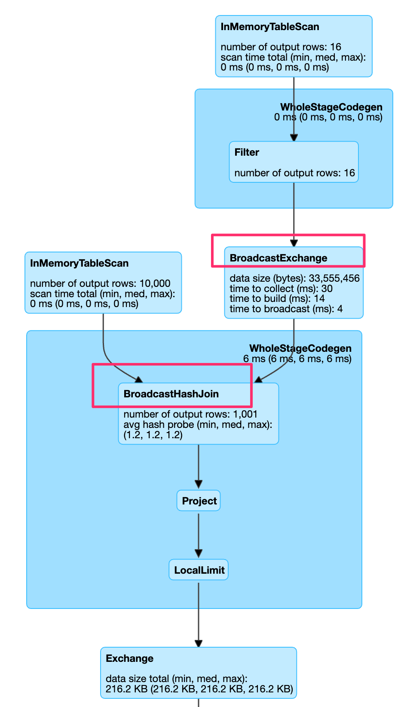

Load spark

```{r}
library(sparklyr)
library(dplyr)
conf <- spark_config()
conf$`sparklyr.shell.driver-memory` <- "8G"
spark <- spark_connect(master = "local", config = conf)
```

## partitions

Spark is a data parallel framework, i.e. parallelizes your code over partitions of data. Therefore it is important that there are enough partitions to keep the CPUs busy. Additionally, it is important that partitions are of similar size, as it would not be beneficial if all tasks but one are complete but that one computes for hours due to data skew.

Let's load some data:

```{r}
library(nycflights13)
flights <- copy_to(spark, flights, "flights")
airlines <- copy_to(spark, airlines, "airlines")
```

this gives us a dataframe with:

```{r}
sdf_num_partitions(flights)
```
Notice, as this dataset is small, it results in a single partition. we might want to increase paralelism for downstream processing.

```{r}
repartitioned <- sdf_repartition(flights, 8)
sdf_num_partitions(repartitioned)
```
This causes a  hash partitioning of the data.
Sometimes more control is needed as we need to specify which records need to be in the same partition.
```{r}
head(sdf_repartition(flights, 8, partition_by = "carrier"))
```

Explicity tuning paralellism and most importantly preventing data skew are very important when working with large data sets.

## JOINs

In the first workbook we already looked into JOINs. Let us revisit them.

As our data is distributed it resides on many different nodes:

in particular, a file is broken into blocks distributed among different computers.

For **wide** transformations (joins, aggregations) data needs to be transferred between nodes to compute the result.
In case of a JOIN which in the worst case:

data needs to be shuffled between both data frames. Especially if both dataframes are large, this leads to a lot of IO.

In special cases where one of the dataframes is small, we can do better. A broadcast-hash-join can be used:

the small dataframe is copied to all the executors. Then a map-side JOIN operation can be performed which is much faster.

> It is important to tune `spark.sql.autoBroadcastJoinThreshold` parameter. By default only dataframes up to 10MB are broadcasted.

Lets look at some data:

```{r}
# disable broadcast joins
spark_session_config(spark, config = "spark.sql.autoBroadcastJoinThreshold", value = 0)
flights %>% left_join(airlines)
```
look at the UI http://localhost:4040/SQL/
It should be similar to: 

```{r}
# set some value
spark_session_config(spark, config = "spark.sql.autoBroadcastJoinThreshold", value = 1000)
flights %>% left_join(airlines)
```
Now, with broadcasting enabled again:


When looking at the execution times yo will observe that the broadcast join is much faster. On my machine it takes 0.2 Seconds vs. the sort merge join which takes 1 second.

## UDF

It looks like Dataframes can do anything. But they can't. They are limited to the classical SQL commands. But they can do more. Using UDF (user definded functions) you can run any procedural code or R command in a distributed way over more data to quicker gain results.

However, they come with a cost...

- UDFs cannot be optimized by the Catalyst Optimizer - someday, maybe, but for now it has no insight to your code, unless you write custom catalyst optimizations (which are rather complex to create).
- The function has to be serialized and sent out to the executors - this is a one-time cost, but a cost just the same.
- If you are not careful, you could serialize the whole world.
- In the case of Python or R, there is even more over head - we have to spin up a Python / R interpreter on every Executor to run your Lambda and transfer the data between the JVM and the Python / R process.

> For most of the things you want to accomplish there is already an optimized spark-native SQL function! Try to look it up carefully as this will result in less code ( more maintainable, declarative) and faster resutls (catalyst optimizations)

But there are some cases there the built in functions are not enough.
> NOTE apparently, this does not yet work with Arrow /I can't get it to work on my machine.

```{r}
my_df <- sdf_len(spark, 10) 
my_df %>% spark_apply(function(df) df * 10) # R colusre
my_df %>% mutate(id = id*10) # native spark code
```

demos how to run a R closure /function in a distruted way via spark. Obviously it is not efficient.

A more complete example
```{r}
iris_tbl <- copy_to(spark,iris)
iris_tbl %>%
  spark_apply(
    function(e) data.frame(2 * e$Sepal_Length, e),
    names = c("2xS_len", colnames(iris_tbl)))
```
but still not really mandating the use of a R native UDF. But think about a dataset in your domain. Maybe genomics. Here you could use a standard R function to parse DNA sequences and parallelize it. This would be a case where a R native UDF really makes sense.

But it get's more interesting with UADF (user defined aggregate functions)
## UADF

Assume you have a big data set and for each group you want to compute an aggregation. In general this is rather easy via sparklyr or the SQL API for standard SQL aggregations (mean,sum,count).
However, when you want to fit a model, i.e. a more complex and non standard aggregation it gets a bit more complicated.
If you were using native (java, scala) spark you could write a custom UADF. This is not possible from R.
sparkR however offers `gapply` to handle working with groups. 
Recently, sparklyr introduced `sapply` which also can operate on grouped datasets which easily allows to scale out computation i.e. paralellize it per each group.

Compute a linear model for the iris dataset for each group of species:
```{r}
iris_tbl %>%
  spark_apply(
  function(e) broom::tidy(lm(Petal_Width ~ Petal_Length, e)),
  names = c("term", "estimate", "std.error", "statistic", "p.value"),
  group_by = "Species"
)
```

> Note: as outlined here https://spark.rstudio.com/guides/distributed-r/ you need to extract tabular names from the output of the function in order to properly *view* a result. Broom from the tidy universe is a good tool for this.

## Handling errors & using packages
When working with R code inside spark it can cause large exception stacktraces.
An Example:

```{r}
spark_apply(iris_tbl, function(e) stop("Make this fail"))
```

To use R packages inside Spark, your packages must be installed on the worker nodes. The first time you call spark_apply all of the contents in your local .libPaths() will be copied into each Spark worker node via the SparkConf.addFile() function. Packages will only be copied once and will persist as long as the connection remains open. It’s not uncommon for R libraries to be several gigabytes in size, so be prepared for a one-time tax while the R packages are copied over to your Spark cluster. You can disable package distribution by setting packages = FALSE. Note: packages are not copied in local mode (master="local") because the packages already exist on the system.


## Reading JSON

Find some JSON files and load them into spark.
Examine the schema.

## cleanup

Finally, close the spark session again.
```{r}
spark_disconnect(spark)
```