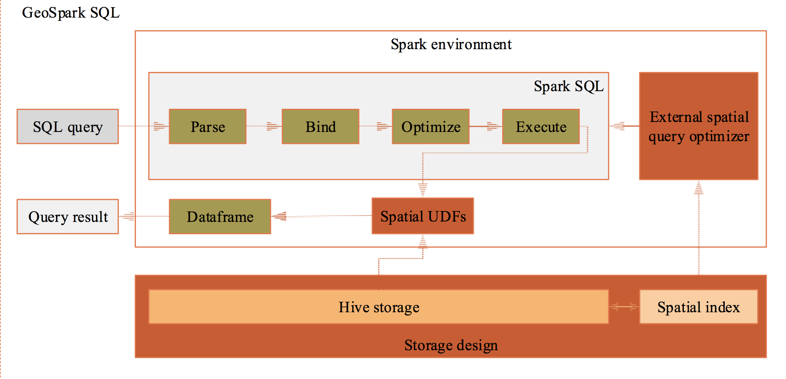
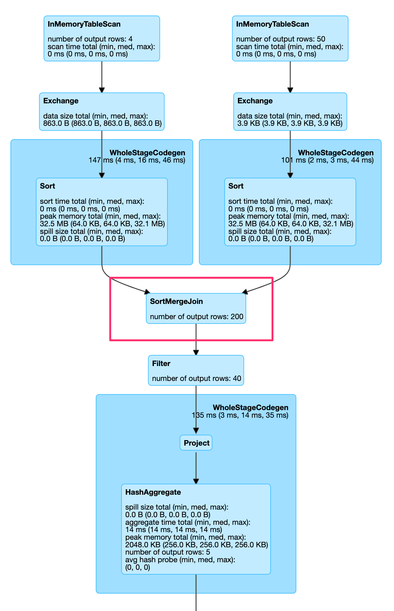
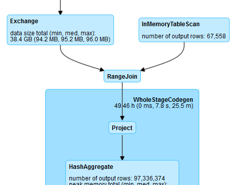

When working with geospatial data in R the $sf$ package usually is a great tool.
But when the data increases one needs to scale out processing capabilities.
Geospark is such a tool. Rcently it added a R API (https://github.com/harryprince/geospark) which now also allows R to tap into the big geospatial ecosystem.

# installation

geospark: mandatroy to run this example
sf, gdal udunits2 are optional (required for visualization)

sf
> TODO get sf to install

```{r eval=FALSE, include=TRUE}
# udunits2 requires a native dependency
# on a mac install via brew install udunits
#install.packages("udunits2")

# same goes for rgdal in case you face probblems
# install.packages('rgdal')

install.packages("sf")
```

geospark 

```{r eval=FALSE, include=TRUE}
devtools::install_github("harryprince/geospark")
```

Then instanciate your spark session. But add additional configuration to use the `GeoSpark` kryo serializer to improve efficiency.
```{r}
library(sparklyr)
library(geospark)
library(dplyr)
library(ggplot2)
if ("arrow" %in% .packages()) detach("package:arrow")
#library(arrow)
conf <- spark_config()
conf$`sparklyr.shell.driver-memory` <- "8G"

# Enable kryo to decrease serialization overhead
conf$spark.serializer <- "org.apache.spark.serializer.KryoSerializer"
conf$spark.kryo.registrator <- "org.datasyslab.geospark.serde.GeoSparkKryoRegistrator"

spark <- spark_connect(master = "local", config = conf)
register_gis(spark)
```

 describes the architecture

Let's load some data points:

```{r}
polygons <- read.table(system.file(package="geospark","examples/polygons.txt"), sep="|", col.names=c("area","geom"))
points <- read.table(system.file(package="geospark","examples/points.txt"), sep="|", col.names=c("city","state","geom"))

polygons_wkt <- copy_to(spark, polygons)
points_wkt <- copy_to(spark, points)
```

A quick visualization of the geometries:
```{r}
library(sf)
library(mapview)
M1 = polygons %>%
sf::st_as_sf(wkt="geom") %>% mapview::mapview()


M2 = points %>%
sf::st_as_sf(wkt="geom") %>% mapview::mapview()

M1+M2
```

## geospatial SQL

Now we can perform a GeoSpatial join using the st_contains which converts wkt into geometry object with 4326 crs which means a wgs84 projection. To get the original data from wkt format, we will use the st_geomfromwkt functions. We can execute this spatial query:

> TODO fails https://github.com/harryprince/geospark/issues/9

```{r}
polygons_wkt <- mutate(polygons_wkt, y = st_geomfromwkt(geom))
points_wkt <- mutate(points_wkt, x = st_geomfromwkt(geom))
points_wkt # y is here
polygons_wkt # x is here

sc_res <- st_join(polygons_wkt %>% select(area,y),
                  points_wkt %>% select(city,state,x), join = sql("st_contains(y,x)")) %>%
  group_by(area, state) %>%
  summarise(cnt = n()) 

sc_res %>%
  show_query()
sc_res %>%
  head
```


Let's look at the data in an interactive map:
```{r}
Idx_df = collect(sc_res) %>% 
right_join(polygons,by = (c("area"="area"))) %>% 
sf::st_as_sf(wkt="geom")

Idx_df %>% 
leaflet::leaflet() %>% 
leaflet::addTiles() %>% 
leaflet::addPolygons(popup = ~as.character(cnt),color=~colormap::colormap_pal()(cnt)) 
```

Look again at the details in spark:

Instead of the desired join above, spark actually executes:


Why is this bad? IT will not scale, as catalyst optimizations are not used to improve upon $O(n^2)$.

What can we do if `dbplyr` does not support the right functions or generates the wrong SQL statements?

We can hand code the SQL. 

For this to work the dataframes need to be registered as temporary tables.
Fortunately, they are already registered. 
However, not with the transformation for the geometries:

```{r}
sdf_sql(spark, "SELECT * FROM points LIMIT 2")
sdf_sql(spark, "SELECT * FROM polygons LIMIT 2")

sdf_sql(spark, "SELECT * FROM points a, polygons b WHERE ST_Intersects(b.geom, a.geom)") ## 
```
Fails, as the geometries are still plain strings / coordinates and not geometry objects.
You can re-register them using: `sparklyr::sdf_register(sdf, "tbl_name")`

```{r}
sdf_register(points_wkt, "points_wkt")
sdf_register(polygons_wkt, "polygons_wkt")
```

```{r}
sdf_sql(spark, "SELECT * FROM points_wkt a, polygons_wkt b WHERE ST_Intersects(b.geom, a.geom)") ## 
```
Also fails, as the geoemtry types are (strangely) not yet parsed.

But:
```{r}
points_wkt %>%
  rename(point_geom = geom) %>%
  sdf_register("point_geom")


sdf_sql(spark, "SELECT * FROM point_geom, polygons WHERE ST_Intersects(ST_geomFromWKT(geom), ST_geomFromWKT(point_geom))")
```

works but in my opinion is not as nice as it should be so:
```{r}
mutate(polygons_wkt, y = st_geomfromwkt(geom)) %>%
  select(-geom)%>%
  sdf_register("poly_geometry")
mutate(points_wkt, x = st_geomfromwkt(geom)) %>%
  select(-geom) %>%
  sdf_register("point_geometry")

sdf_sql(spark, "SELECT * FROM poly_geometry, point_geometry WHERE ST_Intersects(y, x)")
```

Is the code which actually works as expected for an R user's perspective and only calls out to SQL where absolutely required.

> Discussion to improve the package is ongoging at https://github.com/rstudio/sparklyr/issues/1977 maybe at a later point in time writing the SQL code is no longer required.

## cleanup

Finally, close the spark session again.
```{r}
spark_disconnect(spark)
```
