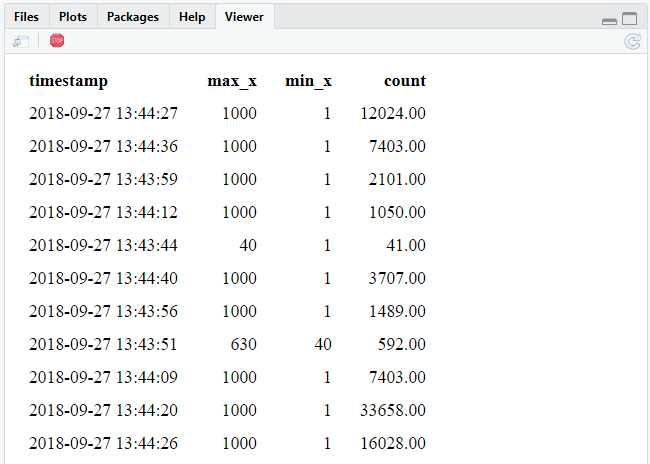

```{r}
library(future)
library(sparklyr)
library(dplyr)
library(ggplot2)
# library(arrow)
conf <- spark_config()
conf$`sparklyr.shell.driver-memory` <- "8G"
# Enable kryo to decrease serialization overhead
conf$spark.serializer <- "org.apache.spark.serializer.KryoSerializer"
spark <- spark_connect(master = "local", config = conf)
```
The following is based on https://spark.rstudio.com/guides/streaming/

## basic IO

```{r}
source <- "streaming_source"
destination <- "streaming_destination"
if(file.exists(source)) unlink(source, TRUE)
if(file.exists(destination)) unlink(destination, TRUE)

stream_generate_test(iterations = 1, path = source)
read_folder <- stream_read_csv(spark, source) 
write_output <- stream_write_csv(read_folder, destination)
invisible(future(stream_generate_test(interval = 0.2, iterations = 100, path = source)))

stream_view(write_output)
```
You should see something similar to:

stop when complete:

```{r}
stream_stop(write_output)
```

What happened:
The output writer is what starts the streaming job. It will start monitoring the input folder, and then write the new results in the “source-out” folder. So as new records stream in, new files will be created in the “source-out” folder. Since there are no operations on the incoming data at this time, the output files will have the same exact raw data as the input files. The only difference is that the files and sub folders within “source-out” will be structured how Spark structures data folders.

## processing

```{r}
if(file.exists(source)) unlink(source, TRUE)
if(file.exists(destination)) unlink(destination, TRUE)

stream_generate_test(iterations = 1, path = source)
read_folder <- stream_read_csv(spark, source) 

process_stream <- read_folder %>%
  mutate(x = as.double(x)) %>%
  ft_binarizer(
    input_col = "x",
    output_col = "over",
    threshold = 400
  )

write_output <- stream_write_csv(process_stream, destination)
invisible(future(stream_generate_test(interval = 0.2, iterations = 100, path = source)))
```

Run this code a few times during the experiment:

```{r}
#stream_view(write_output)
spark_read_csv(spark, source, destination, memory = FALSE) %>%
  group_by(over) %>%
  tally()
```
The counters will increase over time

## Aggregate in process and output to memory

```{r}
if(file.exists(source)) unlink(source, TRUE)
if(file.exists(destination)) unlink(destination, TRUE)

stream_generate_test(iterations = 1)
read_folder <- stream_read_csv(sc, source) 

process_stream <- read_folder %>%
  stream_watermark() %>% # stream_watermark() add a new timestamp column that is then used in the group_by()
  group_by(timestamp) %>%
  summarise(
    max_x = max(x, na.rm = TRUE),
    min_x = min(x, na.rm = TRUE),
    count = n()
  )
my_table <- "stream"
write_output <- stream_write_memory(process_stream, name = my_table)

invisible(future(stream_generate_test(interval = 0.2, iterations = 50, path = source)))
```

Run this command a different times while the experiment is running:
```{r}
tbl(spark, my_table) 
```

Clean up after the experiment
```{r}
stream_stop(write_output)
```

## Shiny integration

Shiny allows R to quickly generate some nice looking interactive web UI.
https://rstudio.github.io/shinydashboard/ is a great template.
We will start with something visually simpler though:

```{r}
if(file.exists(source)) unlink(source, TRUE)
if(file.exists(destination)) unlink(destination, TRUE)

stream_generate_test(iterations = 1)
read_folder <- stream_read_csv(spark, source) 

process_stream <- read_folder %>%
  stream_watermark() %>%
  group_by(timestamp) %>%
  summarise(
    max_x = max(x, na.rm = TRUE),
    min_x = min(x, na.rm = TRUE),
    count = n()
  )

invisible(future(stream_generate_test(interval = 0.2, iterations = 200, path = source)))

library(shiny)
ui <- function(){
  tableOutput("table")
}
server <- function(input, output, session){
  
  ps <- reactiveSpark(process_stream)
  
  output$table <- renderTable({
    ps() %>%
      mutate(timestamp = as.character(timestamp)) 
    })
}
runGadget(ui, server)
```
You should see something similar to:



Clean up after the experiment
```{r}
stream_stop(write_output)
```

## ML Pipeline Model

```{r}
if(file.exists(source)) unlink(source, TRUE)
if(file.exists(destination)) unlink(destination, TRUE)

df <- data.frame(x = rep(1:1000), y = rep(2:1001))

stream_generate_test(df = df, iteration = 1, path=source)

model_sample <- spark_read_csv(spark, "sample", source)

pipeline <- spark %>%
  ml_pipeline() %>%
  ft_r_formula(x ~ y) %>%
  ml_linear_regression()

fitted_pipeline <- ml_fit(pipeline, model_sample)

ml_stream <- stream_read_csv(
    sc = spark, 
    path = source, 
    columns = c(x = "integer", y = "integer")
  )  %>%
  ml_transform(fitted_pipeline, .)  %>%
  select(- features) %>%
  stream_write_csv(destination)

stream_generate_test(df = df, interval = 0.5, path = source, iterations = 100)
```
Run this code a few times during the experiment:
```{r}
spark_read_csv(spark, "stream", destination, memory = FALSE) 
```

Then stop the stream or alternatively hit the stop buttin in the UI.
```{r}
stream_stop(ml_stream)
```


## cleanup

Finally, close the spark session again.
```{r}
spark_disconnect(spark)
```
