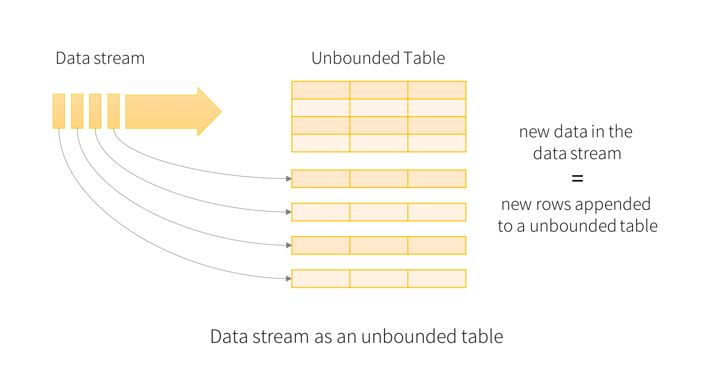

Spark operates in micro batches, but recently added (alpha version) a continous procesing mode. Also, recently support for structured (SQL like) streaming was added.

```{r}
library(future)
library(sparklyr)
library(dplyr)
library(ggplot2)
# library(arrow)
conf <- spark_config()
conf$`sparklyr.shell.driver-memory` <- "8G"
# Enable kryo to decrease serialization overhead
conf$spark.serializer <- "org.apache.spark.serializer.KryoSerializer"
spark <- spark_connect(master = "local", config = conf)
```
The following is based on https://spark.rstudio.com/guides/streaming/

## Reading from a stream

In a shell type
```{bash, eval=FALSE, include=TRUE}
nc -lk 9999
Hello
World
Foo Bar
bbaz
```

Then start the streaming process
```{r}
destination <- "streaming_destination"
if(file.exists(destination)) unlink(destination, TRUE)
read_folder <- stream_read_scoket(spark, options = list(host = "localhost", port = 9999)) 
write_output <- stream_write_csv(read_folder, destination, mode = "append")
```

And watch the file system in the output directory.
Type some more lines in the shell.

Finally cleanup / stop button in RStudio:
```{r}
stream_stop(write_output) # cleanup
```

What happened?

### micro-batch processing

Spark operates in micro batches


it is important that each batch finishes befor the next one needs to be processed to be stable:


### unbounded table

Spark Structured Streaming adds a declarative layer on top and allows you to think about unbounded tables.
Incoming data get's appended to an unbounded table.


# Querying the input table

A query on the input will generate the “result table”. Every trigger interval (for sparklyR by default  1000 milliseconds, `stream_trigger_interval()` to change it), a new row gets appended to the input table, which eventually updates the result table. Whenever the result table gets updated, we would want to write the changed result rows to an external sink.

At every trigger Interval:

- New rows are appended to the input table.
- The query is re-executed.
- The result table table is updated accordingly.
- The rows are written to some external output, or sink.


### output modes

The “Output” is defined as what gets written out to the external storage.
Three different output modes are supported as of spark 2.1.1:


- Complete Mode - The entire updated Result Table will be written to the external storage. It is up to the storage connector to decide how to handle writing of the entire table.

- Append Mode (default) - Only the new rows appended in the Result Table since the last trigger will be written to the external storage. This is applicable only on the queries where existing rows in the Result Table are not expected to change.

- Update Mode - Only the rows that were updated in the Result Table since the last trigger will be written to the external storage (available since Spark 2.1.1). Note that this is different from the Complete Mode in that this mode only outputs the rows that have changed since the last trigger. If the query doesn’t contain aggregations, it will be equivalent to Append mode.

## streaming aggregation

More complex processing. Let's split the words and perform the classic word count in streaming fashion.
Again, read from a tcp-ip socket:

```{r}
read_folder <- stream_read_scoket(spark, options = list(host = "localhost", port = 9999)) 
my_table <- "stream"
DBI::dbGetQuery(spark, paste("DROP TABLE IF EXISTS", my_table))

process_stream <- read_folder %>%
  ft_tokenizer(input_col = "value", 
               output_col = "word_list") %>% # split each line
  mutate(word = explode(word_list)) %>%
  group_by(word) %>%
  summarise(
    count = n()
  )
write_output <- stream_write_memory(process_stream, name = my_table)

# watch the spark UI http://localhost:4040/jobs/
tbl(spark, my_table) # refresh a couple of times after typing in the shell

stream_stop(write_output) # cleanup / stop buttion
```

The query on the streaming lines dataFrame to generate wordCounts is exactly the same as it would be a static dataFrame. However, when this query is started, Spark will continuously check for new data from the socket connection. If there is new data, Spark will run an “incremental” query that combines the previous running counts with the new data to compute updated counts, as shown below.


**Note that Structured Streaming does not materialize the entire table.** It reads the latest available data from the streaming data source, processes it incrementally to update the result, and then discards the source data. It only keeps around the minimal intermediate state data as required to update the result (e.g. intermediate counts in the earlier example).

## basic IO

Another example which also visualizes the stream and reads some files.

```{r}
source <- "streaming_source"
destination <- "streaming_destination"
if(file.exists(source)) unlink(source, TRUE)
if(file.exists(destination)) unlink(destination, TRUE)

stream_generate_test(iterations = 1, path = source)
read_folder <- stream_read_csv(spark, source) 
write_output <- stream_write_csv(read_folder, destination)
invisible(future(stream_generate_test(interval = 0.2, iterations = 100, path = source)))

stream_view(write_output)
```

You should see something similar to:


stop when complete:

```{r}
stream_stop(write_output)
```

What happened:
The output writer is what starts the streaming job. It will start monitoring the input folder, and then write the new results in the “source-out” folder. So as new records stream in, new files will be created in the “source-out” folder. Since there are no operations on the incoming data at this time, the output files will have the same exact raw data as the input files. The only difference is that the files and sub folders within “source-out” will be structured how Spark structures data folders.

## streaming aggregartion with ml pre-processing step

This example builds on the previous. It adds a processing step that manipulates the input data before saving it to the output folder. In this case, a new binary field is added indicating if the value from x is over 400 or not.

```{r}
if(file.exists(source)) unlink(source, TRUE)
if(file.exists(destination)) unlink(destination, TRUE)

stream_generate_test(iterations = 1, path = source)
read_folder <- stream_read_csv(spark, source) 

process_stream <- read_folder %>%
  mutate(x = as.double(x)) %>%
  ft_binarizer(
    input_col = "x",
    output_col = "over",
    threshold = 400
  )

write_output <- stream_write_csv(process_stream, destination)
invisible(future(stream_generate_test(interval = 0.2, iterations = 100, path = source)))
```

Run this code a few times during the experiment:

```{r}
#stream_view(write_output)
spark_read_csv(spark, source, destination, memory = FALSE) %>%
  group_by(over) %>%
  tally()
```
The counters will increase over time as more data is processed
Stop  the experiment

## Aggregate in process and output to memory

Another option is to save the results of the processing into a in-memory Spark table. Unless intentionally saving it to disk, the table and its data will only exist while the Spark session is active.

The biggest advantage of using Spark memory as the target, is that it will allow for aggregation to happen during processing. This is an advantage because aggregation is not allowed for any file output, expect Kafka, on the input/process stage.


```{r}
if(file.exists(source)) unlink(source, TRUE)
if(file.exists(destination)) unlink(destination, TRUE)

stream_generate_test(iterations = 1, path = source)
read_folder <- stream_read_csv(spark, source) 

process_stream <- read_folder %>%
  stream_watermark() %>% # stream_watermark() add a new timestamp column that is then used in the group_by()
  group_by(timestamp) %>%
  summarise(
    max_x = max(x, na.rm = TRUE),
    min_x = min(x, na.rm = TRUE),
    count = n()
  )
my_table <- "stream"
write_output <- stream_write_memory(process_stream, name = my_table)

invisible(future(stream_generate_test(interval = 0.2, iterations = 500, path = source)))
```

Run this command a different times while the experiment is running:
```{r}
tbl(spark, my_table) 
```

Clean up after the experiment
```{r}
stream_stop(write_output)
```

## Shiny integration

[Shiny](https://shiny.rstudio.com/) allows R to quickly generate some nice looking interactive web UI.
https://rstudio.github.io/shinydashboard/ is a great template.
We will start with something visually simpler though.

Each time a new data point arrives and a trigger is triggered (1 second) the dashboard is updated.

```{r}
if(file.exists(source)) unlink(source, TRUE)
if(file.exists(destination)) unlink(destination, TRUE)

stream_generate_test(iterations = 1,  path = source)
read_folder <- stream_read_csv(spark, source) 

process_stream <- read_folder %>%
  stream_watermark() %>%
  group_by(timestamp) %>%
  summarise(
    max_x = max(x, na.rm = TRUE),
    min_x = min(x, na.rm = TRUE),
    count = n()
  )

invisible(future(stream_generate_test(interval = 0.2, iterations = 200, path = source)))

library(shiny)
ui <- function(){
  tableOutput("table")
}
server <- function(input, output, session){
  
  ps <- reactiveSpark(process_stream)
  
  output$table <- renderTable({
    ps() %>%
      mutate(timestamp = as.character(timestamp)) 
    })
}
runGadget(ui, server)
```

You should see something similar to:


Clean up after the experiment
```{r}
stream_stop(write_output)
```

## ML Pipeline Model

This example uses a fitted Pipeline Model to process the input, and saves the predictions to the output. This approach would be used to apply Machine Learning on top of streaming data.

```{r}
if(file.exists(source)) unlink(source, TRUE)
if(file.exists(destination)) unlink(destination, TRUE)

df <- data.frame(x = rep(1:1000), y = rep(2:1001))

stream_generate_test(df = df, iteration = 1, path=source)

model_sample <- spark_read_csv(spark, "sample", source)

pipeline <- spark %>%
  ml_pipeline() %>%
  ft_r_formula(x ~ y) %>%
  ml_linear_regression()

fitted_pipeline <- ml_fit(pipeline, model_sample)

ml_stream <- stream_read_csv(
    sc = spark, 
    path = source, 
    columns = c(x = "integer", y = "integer")
  )  %>%
  ml_transform(fitted_pipeline, .)  %>%
  select(- features) %>%
  stream_write_csv(destination)

stream_generate_test(df = df, interval = 0.5, path = source, iterations = 100)
```
Run this code a few times during the experiment:
```{r}
spark_read_csv(spark, "stream", destination, memory = FALSE) 
```

Then stop the stream or alternatively hit the stop buttin in the UI.
```{r}
stream_stop(ml_stream)
```

## cleanup

Finally, close the spark session again.
```{r}
spark_disconnect(spark)
```
