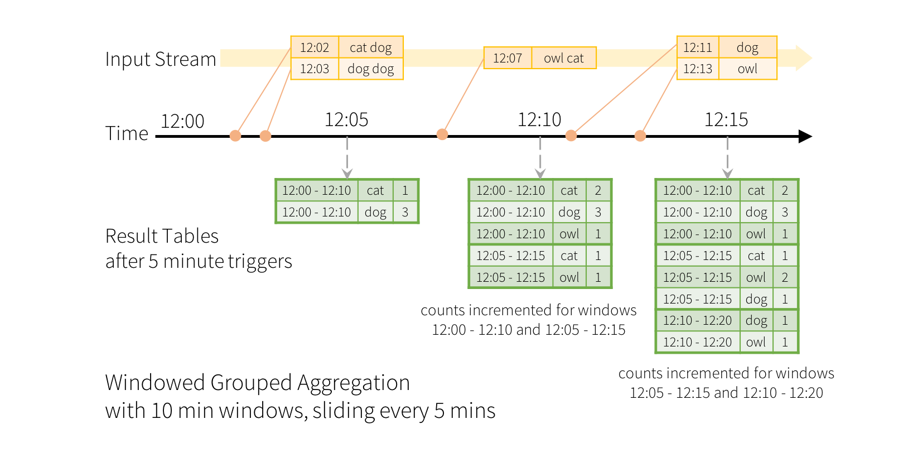
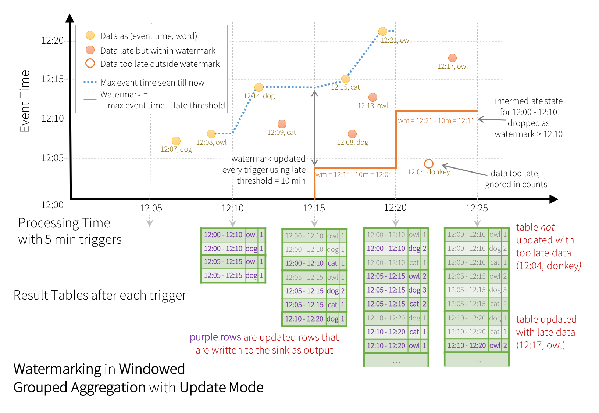

Load spark
```{r}
library(sparklyr)
library(dplyr)
# library(arrow)
conf <- spark_config()
conf$`sparklyr.shell.driver-memory` <- "8G"
# Enable kryo to decrease serialization overhead
conf$spark.serializer <- "org.apache.spark.serializer.KryoSerializer"
spark <- spark_connect(master = "local", config = conf)
```

## introduction to kafka
- distributed mesage queue
- highly scalable

> Docker required! As well as kafkacat. On a mac simply install with brew install kafkacat, or for linux look at https://github.com/edenhill/kafkacat

start kafka

```{bash, eval=FALSE, include=TRUE}
docker-compose up
```

Now open two terminals. The first one (writer):
```{bash, eval=FALSE, include=TRUE}
kafkacat -P -b localhost:9092 -t topic1
#starts producer

Hello Kafka
this is spark
...
write some more text
foo
```
The second one (reader):
```{bash, eval=FALSE, include=TRUE}
kafkacat -C -b localhost:9092 -t topic1
#starts listener
# you shold see some output when typing in terminal 1
```

## Theory
### Window Operations on Event Time

Aggregations over a sliding event-time window are straightforward with Structured Streaming and are very similar to grouped aggregations.



However, to run this query for days, it’s necessary for the system to bound the amount of intermediate in-memory state it accumulates. Watermarking has been introduced just for this.
In R `stream_watermark(df, column="timestamp", threshold="10 minutes")` enables Watermarking.




### JOINs

As of Spark 2.3 also Stream-stream and not only stream-static joins are available.

### Triggers

- unspecified. Generates a new microbatch after the last one has finished.
- fixed micro batches, in R `stream_trigger_interval`
- run once https://databricks.com/blog/2017/05/22/running-streaming-jobs-day-10x-cost-savings.ht
- continous

### Basics in R

> NOTE: this is still rather experimental and not well supported in the `dbplyr` tooling. Falling back to executing textual `SQL` is required for now. See https://github.com/rstudio/sparklyr/issues/1977 for details.

```{r}

```


### Example

TODO  test data generation in https://www.confluent.io/blog/easy-ways-generate-test-data-kafka

The following is based on https://dzone.com/articles/topology-based-event-correlation-with-apache-spark

TODO other example test data from wiki
https://www.matthowlett.com/2017-12-23-exploring-wikipedia-ksql.html

```{bash, eval=FALSE, include=TRUE}
git clone git@github.com:tashoyan/telecom-streaming.git

# prerequesite: mvn installed
cd telecom-streaming
mvn clean package
cd ..
###########################
# to download a scala 2.12 compatible version of spark we need to build from source
export MAVEN_OPTS="-Xmx2g -XX:ReservedCodeCacheSize=512m"
git clone git@github.com:apache/spark.git
cd spark
git checkout v2.4.1
./dev/make-distribution.sh --name custom-spark --tgz -Psparkr -Phadoop-2.7 -Phive -Phive-thriftserver -Pyarn -DskipTests -P scala-2.12
cd ..
# TODO move, unzip, ...
rm -rf spark

# hack create kafka topics in different terminals
kafkacat -P -b localhost:9092 -t events
kafkacat -P -b localhost:9092 -t alarms
kafkacat -C -b localhost:9092 -t events
kafkacat -C -b localhost:9092 -t alarms

# now run by hand line for line
in file: ./telecom-streaming-r/bin/event-generator.sh
```

```{r}
stream_trigger_interval

stream_watermark
```


Finally cleanup / stop butting in RStudio:
```{r}
stream_view(write_output)
stream_stop(write_output) # cleanup
```


## cleanup

Finally, close the spark session again.
```{r}
spark_disconnect(spark)
```

clean docker things

```{bash, eval=FALSE, include=TRUE}
docker-compose rm -f
docker images
# docker system prune
```

