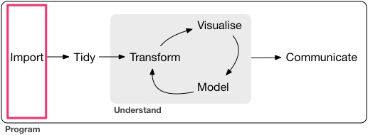
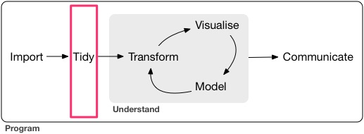
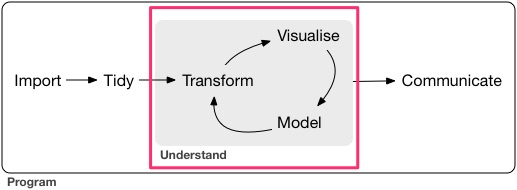
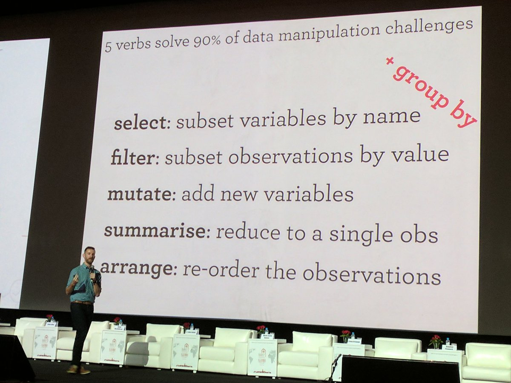

Based on https://github.com/RSummerSchool/Reproducible_Research 
```{r setup, include=FALSE}
knitr::opts_chunk$set(echo = TRUE)
```

> The tidyverse is an opinionated collection of R packages designed for data science. All packages share an underlying philosophy and common APIs.
>
> -- <cite>[tidyverse.org](https://www.tidyverse.org/)</cite>

The workflow of a typial data science workflow looks as follows

```{r project-flow, out.width="100%",fig.cap="Flow of a typical data science project - source: http://r4ds.had.co.nz/introduction.html", echo=FALSE} 
knitr::include_graphics("img/tidyverse-flow.png") 
```

## Loading the tidyverse

To load the tidyverse like any other package via `library`

```{r loading-the-tidyverse}
library(tidyverse)
```

By default the following Packages are loaded:

* ggplot2 - Data visualisation
* tibble - Improved data.frame implementation
* tidyr - Tidy data + spread/gather functions
* readr - Read flat files (csv, tsv, fwf)
* purrr - Functional programming - incl. an improved *apply implementation
* dplyr - Data manipulation

## The pipe `%>%`

Before we start we introduce the pipe operator `%>%` - see https://github.com/tidyverse/magrittr

This operator takes the left hand side and _plugs_ it into the right hand side as first argument.

* `f(x)` equivalent to `x %>% f()`
* `f(x, y)` is equivalent to `x %>% f(y)`
* `h(g(f(x)))` is equivalent to `x %>% f %>% g %>% h`

This operator makes the code much more readable as we will see throughout this presentation.

A simple example:

```{r pipe-example}
iris %>% head # head(iris)
c(1, 4, 9, 16, 25) %>% sqrt # sqrt(c(1, 4, 9, 16, 25))
1:10 %>% paste0(LETTERS[.]) # paste0(1:10, LETTERS[1:10])
```

All of the functions in the tidyverse are written to be `pipeable`

## Importing data

```{r project-flow-import, out.width="100%",fig.cap="Flow of a typical data science project - source: http://r4ds.had.co.nz/introduction.html", echo=FALSE} 
 
```

Lots of data science projects stark with a given dataset you want to analyse.

In this presentation we are goint to analyse a given csv (comma seperated values) file `pokemon_raw.csv` with Pokemon stats from PokemonGo. 

If your data is saved in a database use [`dbplyr`](https://github.com/tidyverse/dbplyr), it is the tidyverse database backend (e.g. for MySQL/MariaDB, Postgresql and SQLite as well as Hive or Spark).

To load data into __R__ you can use the `read_csv` (with an underscore) function or just use the GUI of RStudio to generate the desired __R__ code snippet for you:

```{r read-csv}
# The first column is a comment => skip = 1
read_csv("datasets/pokemon_raw.csv", skip = 1) 
```

If you do not specify the `col_types` `read_csv` guesses the col_type based on the first 1000 columns.
In the above case 

> Specify the col_types explicitly: To make your research reproduciable

```{r read-csv-explicit}
read_csv("datasets/pokemon_raw.csv", 
         skip = 1,
         col_types = cols(
           german = col_character(),
           path = col_character(),
           rn = col_integer(),
           generation = col_character(),
           color = col_character(),
           english = col_character(),
           ep_to_100 = col_character(),
           gender = col_character(),
           size = col_character(),
           types = col_character(),
           weight = col_character(),
           attack = col_integer(),
           speed = col_integer(),
           hp = col_integer(),
           attack_special = col_integer(),
           defense_special = col_integer(),
           defense = col_integer()
        )
) 
```

These default `col_types` assume a US-based number and date format. The column size holdes values like `1,1 m` which is a number with a comma (`,`) as decimal mark. To make `read_csv` read the numbers correctly use the `locale` parameter and `col_number` as follows:

`col_number` drops any non-numeric characters before or after the first number. This also works for the `generation` column.

```{r read-csv-explicit-col-number}
pokemon <- read_csv("datasets/pokemon_raw.csv", 
         skip = 1,
         locale = locale(decimal_mark = ",", grouping_mark = "."),
         col_types = cols(
           german = col_character(),
           path = col_character(),
           rn = col_integer(),
           generation = col_number(),
           color = col_character(),
           english = col_character(),
           ep_to_100 = col_number(),
           gender = col_character(),
           size = col_number(),
           types = col_character(),
           weight = col_number(),
           attack = col_integer(),
           speed = col_integer(),
           hp = col_integer(),
           attack_special = col_integer(),
           defense_special = col_integer(),
           defense = col_integer()
        )
) 

pokemon
```

## Tidying Data

```{r project-flow-tidy, out.width="100%",fig.cap="Flow of a typical data science project - source: http://r4ds.had.co.nz/introduction.html", echo=FALSE} 
 
```

The whole philosophy of tidy data can be found in Hadley Wickham's "Tidy data" The Journal of Statistical Software, 2014, Volume 59, Issue 10 - http://www.jstatsoft.org/v59/i10/ (accessed 24.9.2017).

In the case of the `pokemon` data-set we only need to seperate the 
`gender` and the `types` column into multiple columns:

```{r seperate-data}
pokemon %>% select(english, gender, types) # select will be explained later on
```

 This can easily be done via `seperate` as follows.
 
```{r seperate-data-convert}
pokemon %>% 
  select(gender, types) %>% # select will be explained later on
  separate(types, c("type_1", "type_2"), extra = "drop", fill = "right") %>% 
  separate(gender, c("male", "female"), extra = "drop", sep = "[^[:alnum:],]+")
```

This results in the columns `male` and `female` being type character. Below we will fix this using mutate.

Overwrite pokemon with the new variables as follows:

```{r seperate-data-in-pokemon}
ncol(pokemon)

pokemon <- pokemon %>% 
  # select(gender, types) %>% # No select this time
  separate(types, c("type_1", "type_2"), extra = "drop", fill = "right") %>% 
  separate(gender, c("male", "female"), extra = "drop", sep = "[^[:alnum:],]+")

ncol(pokemon)
```


## Transform the data to your needs

```{r project-flow-understand, out.width="100%",fig.cap="Flow of a typical data science project - source: http://r4ds.had.co.nz/introduction.html", echo=FALSE} 
 
```

The visualisation part will be done in the other session about `ggplot2`

At the ISI (World Statistics Congress) 2017 Hadley Wickham said:

```{r five-verbs, out.width="100%",fig.cap="5 verbs solve 90% of data manipulation challenges - source: https://twitter.com/ervance/status/888058950238777344/photo/1 ", echo=FALSE} 
 
```

Inside shese verbs you can use the columns of the dataset as if they were variables.

So lets have a look at them

### select

> select() keeps only the variables you mention

We have used `select` once above to select only the `gender` and the `types` column.
Lets say we only want to have the name, the hp and size of the pokemon. We can use:

```{r select1}
pokemon %>% select(german, english, hp, size)
```

There are some select helpers see `?select_helpers` like `starts_with`:

```{r select2}
pokemon %>% select(starts_with("type"))
```

We can use select to reorder the columns and make sure that we do not drop a variable accidently with `everything()` which selects all not previously selected columns:

```{r select3}
pokemon <- pokemon %>% 
  select(rn, german, english, color, type_1, type_2, size, weight, 
         attack, speed, hp, defense, attack_special, defense_special, 
         ep_to_100, male, female, path, everything())

pokemon
```

To select all columns but a specific one use `-var`. `pokemon %>% select(-rn)` drops the rn column.


### filter

To filter the dataset use the `filter` verb. Lets say we just want pokemon from generation 1 we can use:

```{r filter1}
pokemon %>% filter(generation == 1)
```

This results in the well known 151 pokemon from the original Game Boy games.

You can combine filters with AND `&` and OR `|`. A filter expects a logical vector of the same length as the data:

```{r transform-logical, out.width="100%",fig.cap="Venn diagrams on how to filter - source: http://r4ds.had.co.nz/transform.html ", echo=FALSE} 
knitr::include_graphics("img/transform-logical.png") 
```


```{r filter2}
pokemon %>% filter(generation == 1 & color == "Rot")

pokemon %>% filter(color == "Rot" | color == "Grün")
# the above is equivalent to
pokemon %>% filter(color %in% c("Rot", "Grün"))
```

### mutate

Mutate lets you edit or create columns in your data.

The above created columns `male` and `female` are of type `character`. To fix this we can do:

```{r mutate1}
pokemon <- pokemon %>% 
  mutate(
    male = parse_number(male, locale = locale(decimal_mark = ",")),
    female = parse_number(female, locale = locale(decimal_mark = ","))
  )

pokemon %>% 
  select(male, female)
```

This overwrites the columns in place. 

To add a new variable we can also `mutate` as follows:

```{r mutate2}
pokemon <- pokemon %>% mutate(dual_type = !is.na(type_2))

pokemon %>% select(german, english, type_1, type_2, dual_type)
```

### arrange

To arrange/order the data so that it is more compelling we can use `arrange`

Lets say we want the pokemon ordered by __hp__ we can use:

```{r arrange1}
pokemon %>% 
  arrange(hp) %>% 
  select(rn, german, english, hp, speed)
```

To arrange the data in a descending order, wrap the variable in `desc(.)`. 
To order by multiple columns just use multiple arguments to arrange:

```{r arrange2}
pokemon %>% 
  arrange(hp, desc(speed)) %>% 
  select(rn, german, english, hp, speed)
```

### summarise

To condense the information to a single value you can use summarise.

Lets say we want to know the `mean` and the `median` __hp__ of all pokemon, we can use:

```{r summarise1}
pokemon %>% 
  summarise(
    mean_hp = mean(hp),
    median_hp = median(hp),
    name_int = first(paste(german, english))
    )
```

### Group By

Lets say we want to know the `mean` __hp__ by __generation__. This is where `group_by` comes into play:

```{r summarise2}
pokemon %>% 
  group_by(generation) %>% 
  summarise(
    mean_hp = mean(hp),
    median_hp = median(hp)
    ) %>% 
  mutate(diff_hp = abs(mean_hp - median_hp))
```

If we want to know the number of Pokemon per generation we can use the helper `n()` which gives us the group-size:

```{r summarise3}
pokemon %>% 
  group_by(generation) %>% 
  summarise(n = n())
```

Another question might be: Which pokemon has the most __hp__ per generation.  
This can be answered by:

```{r group_by1}
pokemon %>% 
  group_by(generation) %>% 
  filter(hp == max(hp)) %>% 
  select(rn, generation, german, english, hp)

# Equivalent using arrange
pokemon %>% 
  group_by(generation) %>% 
  arrange(desc(hp)) %>% 
  slice(1L) %>% # select rows by number. Here only the first one. 
  select(rn, generation, german, english, hp)
```

Group by also works with `mutate`. Lets say we want to know how much bigger the maximum hp is than the mean hp:

```{r group_by2}
pokemon %>% 
  group_by(generation) %>% 
  mutate(
    mean_hp = mean(hp), 
    hp_normalized = hp - mean_hp
    ) %>% 
  filter(hp == max(hp)) %>% 
  select(rn, generation, german, english, hp, mean_hp, hp_normalized)
```

## Advanced topics

(if time permits)

### Reading multiple files

Often times you need to read multiple equivalently formatted files into R.

Lets say we would get one csv file per generation.
`pokemon_raw_gen_1.csv`, ..., `pokemon_raw_gen_7.csv`

```{r, include=FALSE}
pokemon2 <- read_csv("datasets/pokemon_raw.csv", skip = 1)
pokemon2 %>% 
  split(.$generation) %>% 
  map2(set_names(seq_along(.)), 
       ~write_csv(.x, path = paste0("datasets/multi-file/pokemon_raw_gen_", .y, ".csv"))) %>% 
  invisible
```

```{r}
poke_files <- list.files("datasets/multi-file", full.names = TRUE)
pokemon2 <- map_df(poke_files, 
       read_csv,
         locale = locale(decimal_mark = ",", grouping_mark = "."),
         col_types = cols(
           german = col_character(),
           path = col_character(),
           rn = col_integer(),
           generation = col_number(),
           color = col_character(),
           english = col_character(),
           ep_to_100 = col_number(),
           gender = col_character(),
           size = col_number(),
           types = col_character(),
           weight = col_number(),
           attack = col_integer(),
           speed = col_integer(),
           hp = col_integer(),
           attack_special = col_integer(),
           defense_special = col_integer(),
           defense = col_integer()
        )
       )

pokemon2
```

### Managing many models

You can use `map` to loop through lists/vectors. One very powerful concept that was introduced in the tidyverse is the nested dataset - https://www.youtube.com/watch?v=rz3_FDVt9eg
Lets say we want to build a model how __hp__ is dependent on __size__.

For the full dataset we can do this as follows
```{r}
require(broom) # tidy model parameter
lm(hp ~ size, data = pokemon) %>% tidy
```

And now we want to fit the same model per generation. To do this we nest the data as follows:
```{r}
(pokemon_nested <- nest(pokemon, -generation))
```

This way we get a tibble (~data.frame) with all the data of one generation in one list-entry.
Now we can model the above using `map` as follows:

```{r}
pokemon_nested %>% 
  mutate(
    mod = map(data, ~lm(hp ~ size, .x)),
    mod_tidy = map(mod, tidy)
  ) %>% 
  unnest(mod_tidy)
```

Further information on this topic:
- https://emor-iebeck.github.io/R-tutorials/purrr/
- https://www.kaggle.com/timib1203/managing-many-models-with-tidyr-purrr-and-broom